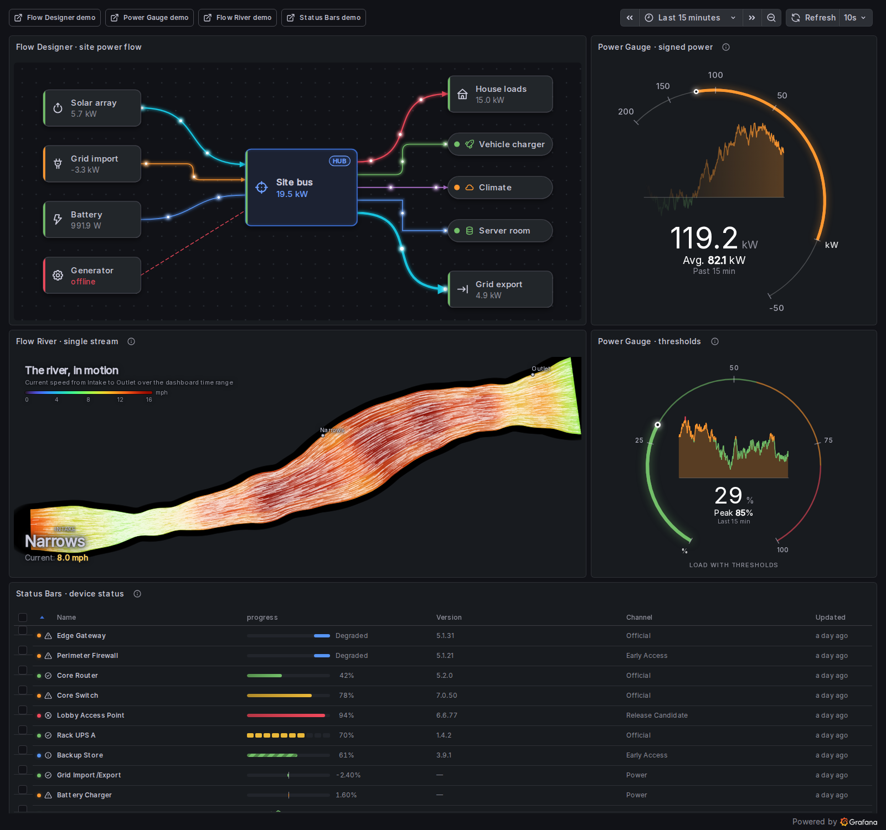
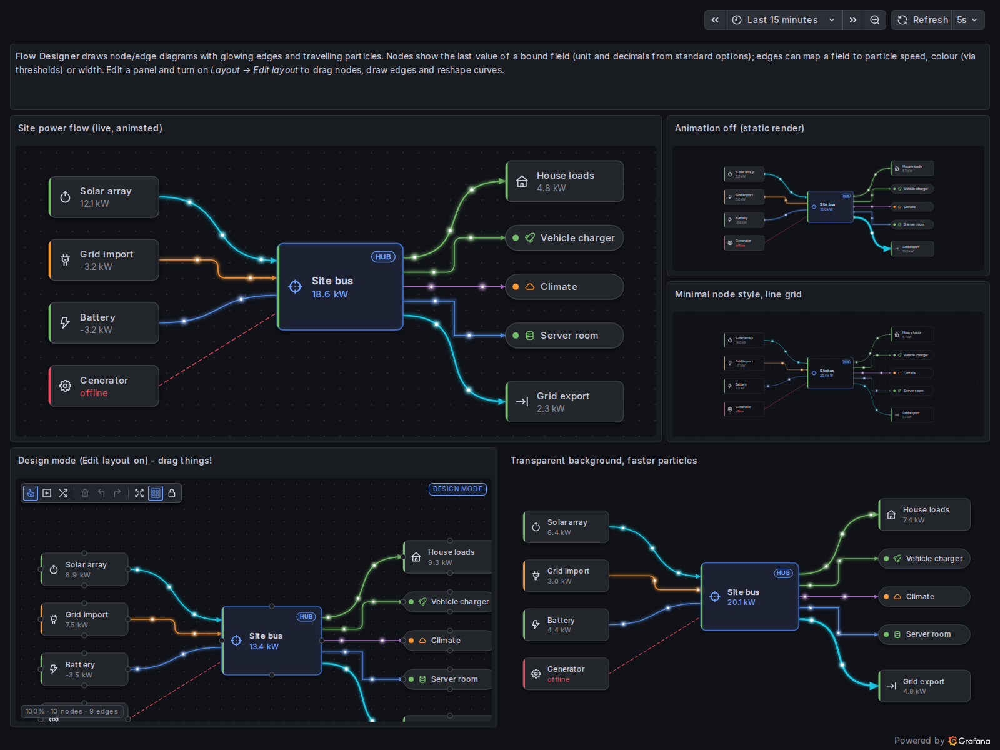
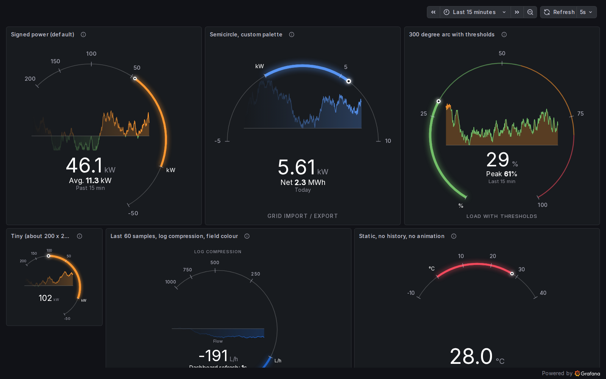
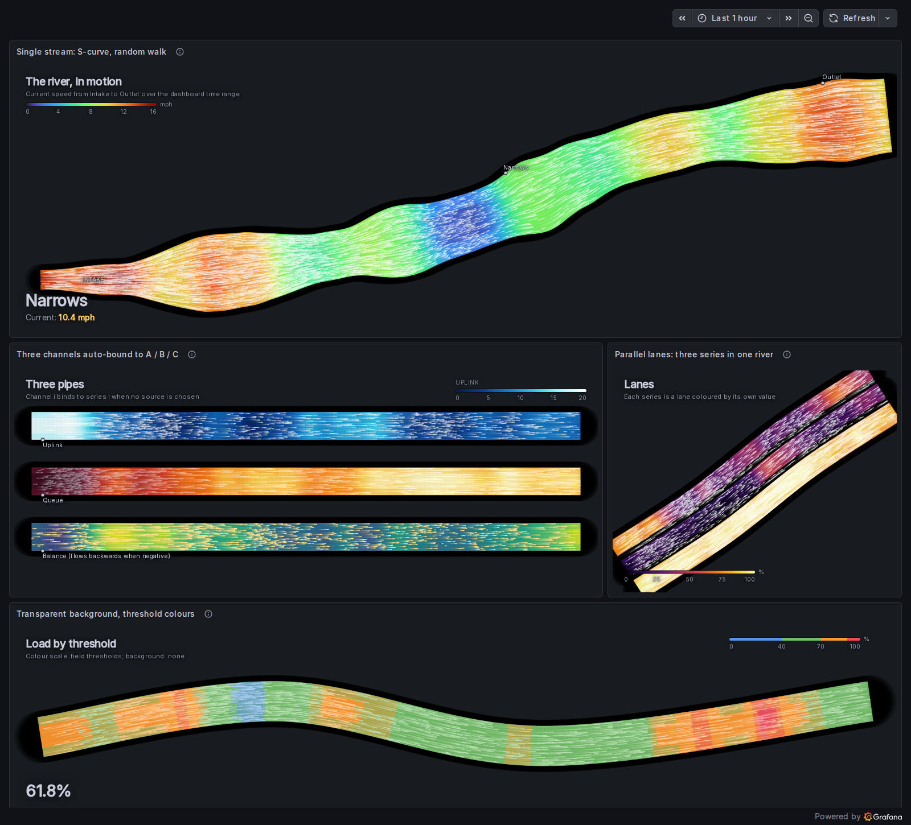
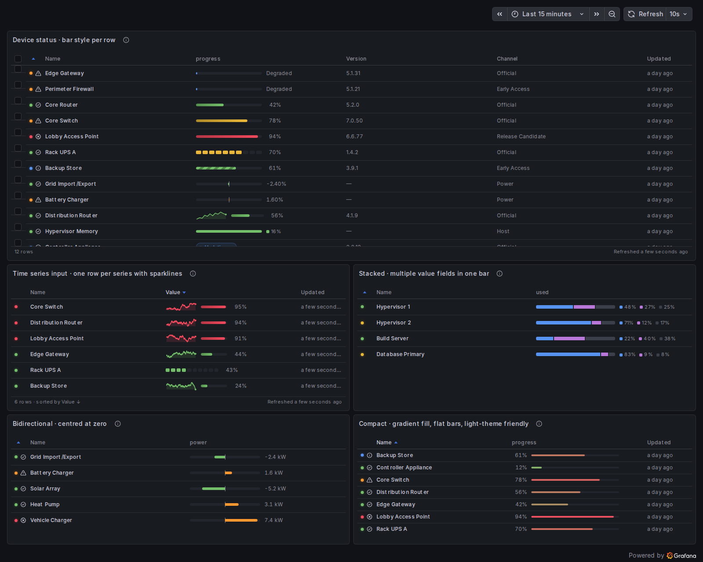
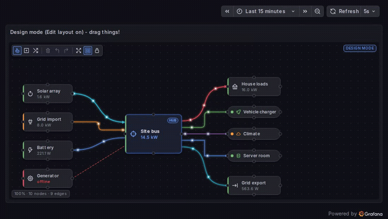
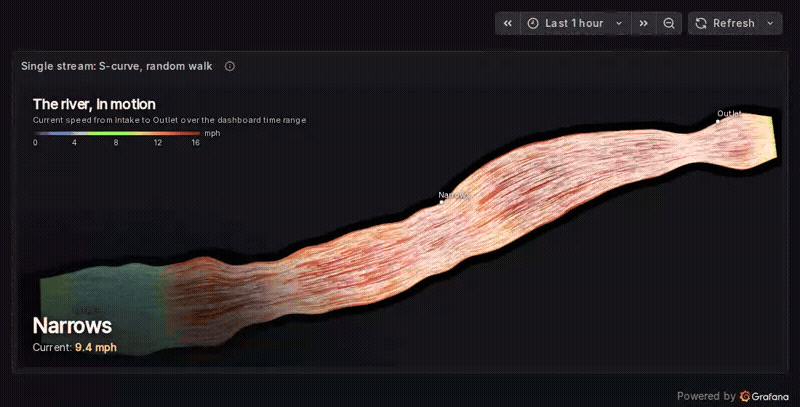

# Impact - Animated Widgets for Grafana

Four visualisations in one plugin: a **Flow Designer** for node-and-edge diagrams with travelling particles, drawn by hand or built from your data, a **Power Gauge** with a signed arc, in-ring history and a live stream mode, a **Flow River** of particle streamlines coloured by value, including a data-driven network map, and **Status Bars** for clean rows of animated progress bars. Every panel renders generated demo data until a query is wired, and the app's Gallery page installs the demo dashboards on any Grafana with one click.

## Screenshots

<p>
  
</p>
<p>
  
  
  
</p>
<p>
  
  
  
</p>

## Quick Start (Provides Grafana and Impact via Docker.)

```bash
git clone https://github.com/SparkAnswers/impact
cd impact
docker compose up

# Grafana:   http://localhost:3000/   (anonymous viewer; admin / admin to edit)
# Port 3000 taken? IMPACT_PORT=3001 docker compose up
# Showcase:  http://localhost:3000/d/impact-showcase
# Demos:     /d/impact-flow, /d/impact-gauge, /d/impact-river, /d/impact-bars
```

`docker compose up` builds the plugin inside a `node:22` container, then starts Grafana 13 with the plugin and the demo dashboards provisioned. Every demo runs on the built-in TestData source, so nothing else is needed.

## Installation (existing Grafana)

Impact is not yet signed by Grafana Labs, so Grafana has to be told to allow it. The bundle contains an app plugin plus four nested panel plugins, and **each id must be allow-listed**.

1. Download `sparkanswers-impact-app-<version>.zip` from the
   [releases page](https://github.com/SparkAnswers/impact/releases) (or build one with `make package`).
2. Unzip it into your Grafana plugins directory so you end up with
   `<plugins dir>/sparkanswers-impact-app/plugin.json`. The default directory is
   `/var/lib/grafana/plugins`.
3. Allow the unsigned plugins, either in `grafana.ini`:

   ```ini
   [plugins]
   allow_loading_unsigned_plugins = sparkanswers-impact-app,sparkanswers-impact-flow-panel,sparkanswers-impact-gauge-panel,sparkanswers-impact-river-panel,sparkanswers-impact-bars-panel
   ```

   or with an environment variable (Docker, Kubernetes):

   ```bash
   GF_PLUGINS_ALLOW_LOADING_UNSIGNED_PLUGINS=sparkanswers-impact-app,sparkanswers-impact-flow-panel,sparkanswers-impact-gauge-panel,sparkanswers-impact-river-panel,sparkanswers-impact-bars-panel
   ```

4. Restart Grafana. The app enables itself on first load and the four panels appear in the visualization picker under the "Impact" prefix.

**Docker one-liner** against the official image, installing straight from a release zip:

```bash
docker run -d -p 3000:3000 \
  -e GF_INSTALL_PLUGINS="https://github.com/SparkAnswers/impact/releases/download/v1.0.0/sparkanswers-impact-app-1.0.0.zip;sparkanswers-impact-app" \
  -e GF_PLUGINS_ALLOW_LOADING_UNSIGNED_PLUGINS=sparkanswers-impact-app,sparkanswers-impact-flow-panel,sparkanswers-impact-gauge-panel,sparkanswers-impact-river-panel,sparkanswers-impact-bars-panel \
  grafana/grafana:13.0.10
```

Grafana Cloud does not accept unsigned plugins; that needs the catalog listing, which is in progress.

## Configuration

All panels use the standard field options (unit, decimals, min/max, thresholds, colour scheme, value mappings, overrides) for every number they display, so nothing is hard-coded to a particular unit. Free-text labels accept dashboard variables. Each panel has a **Background** option (panel, transparent or solid colour) and honours Grafana's own transparent toggle. Each panel has an **Animation** toggle; animation also pauses automatically in hidden tabs and for users who prefer reduced motion, unless the panel's *Reduced motion* option is set to *Always animate*.

Every panel also opens with a **Quick start** group: six presets per panel (for example *Service graph from data*, *300° arc with thresholds*, *Parallel lanes*, *Compact gradient*) that set every option plus the matching unit, range and thresholds with one click, keeping your query, field choices and drawn items. See the per-panel docs for the full list.

### Flow Designer

Draws a diagram you design inside the panel, or builds one from query results. Nodes show the last value of a bound field; edges can map a field to particle speed, colour (via thresholds) or width. Turn on **Layout -> Edit layout** to drag nodes, draw edges from node ports, reshape curves with control-point handles, pan, zoom, undo and redo.

**Data-driven diagrams.** Set **Data -> Diagram source** to `Data`: any frame with `source`, `target` and a value (a table, or Prometheus-style series whose labels carry the endpoints, for example `client`/`server` from tracing service graphs, or `node`/`pod`/`persistentvolumeclaim` from kube-state-metrics) becomes edges, nodes are derived from the endpoints or an optional node frame with id, label, group and status, and a layered or radial layout places everything with stable positions. `Data + manual overrides` lets you drag and restyle individual nodes while the rest follows the data. [docs/flow.md](https://github.com/SparkAnswers/impact/blob/main/docs/flow.md) has copy-paste query recipes for service graphs and host to pod to volume to storage chains.

| Option                 | Description                                                                                 |
| ---------------------- | ------------------------------------------------------------------------------------------- |
| Diagram source         | `Manual`, `Data` or `Data + manual overrides`; with field pickers for source, target, value, label, group, node id and status, layout direction, gaps, wrap layers after (fold a huge layer into side-by-side bands), group boxes, edge labels and Top N |
| Demo data              | `Off`, `When no data` (default) or `Always`: a generated graph until a query is wired       |
| Background             | `Panel`, `Transparent`, `Dot grid` or `Line grid`                                           |
| Node style             | `Cards` (filled, status accent) or `Minimal` (outlined)                                     |
| Default edge colour    | Colour for edges without their own                                                          |
| Particle speed         | Global multiplier for every edge                                                            |
| Edit layout            | Design mode: toolbar, dragging, drawing, pan and zoom. Off by default so viewers never move things |
| Grid size / Snap       | Grid spacing and snapping while dragging                                                    |
| Fit to panel           | Scale and centre the diagram to the panel when not editing                                  |
| Inspector              | Properties of the selected node (shape, icon, label, status, bound field) or edge (style `Bezier` / `Orthogonal` / `Straight` / `Step`, curvature, stroke, colour, dash, arrowhead, glow, particle count / speed / size, bind to field, map value to speed / colour / width) |
| Import / export JSON   | The whole diagram as validated JSON, with a "Load example" button                           |

### Power Gauge

A ring gauge for signed quantities. The fill grows one way from a configurable zero mark for positive values and the other way for negative values, with a live marker on the ring and a history chart of the visible window inside it.

| Option                           | Description                                                                                     |
| -------------------------------- | ----------------------------------------------------------------------------------------------- |
| Field                            | Numeric field to show; defaults to the first one                                                |
| Demo data                        | `Off`, `When no data` (default) or `Always`                                                     |
| Start angle / Sweep / Clockwise  | Arc geometry, from a small 180° semicircle to a near-full 300° ring                              |
| Fill width / Ring colour / Glow  | Ring appearance                                                                                 |
| Zero mark / Zero position        | Where the fill starts, and where on the arc it sits                                             |
| Scale                            | `Linear`, `Square root` or `Log` compression of the positive side                               |
| Ticks / Tick values / Tick labels| Automatic or custom ticks, formatted with the field unit                                        |
| Colour mode                      | `Fixed` positive / negative colours, `Thresholds` (ring bands from standard thresholds) or `Field` colour |
| History                          | Show, window (`time range`, `last N` or `stream`), fade older samples, line width, area fill, colour by sign or thresholds |
| Stream duration / Playback delay | In stream mode the chart shows the last N seconds scrolling at a constant speed, played a little behind real time through an adaptive buffer so no gap opens between refreshes |
| Live motion                      | Continuous scroll, marker drift with breathing glow, trail, value follows playback, stale indicator. Only samples already received are played |
| Value label / Show value         | Big number with the field unit, with automatic font sizing                                      |
| Secondary line                   | Computed (`mean`, `last`, `min`, `max`, `sum`, `range` over the window, own unit and decimals) or free text with a `{value}` placeholder |
| Subtitle / Title / Title position| Extra text                                                                                      |
| Animate / Duration               | Ease the marker and fill between values                                                         |

### Flow River

Particle streamlines flowing along one or more channels, coloured by value. A single series is the simplest case: the panel time range becomes the river, oldest at the intake and newest at the outlet. Add channels for more streams.

**Network map.** Set **Data -> Channel source** to `Network map` and feed it the same edge shape as the Flow Designer (source, target, value, optional width value). Every link becomes a river between node pucks, placed by auto layout or by typed positions you can match to a floor plan, with reverse pairs offset so both directions stay readable.

| Option                      | Description                                                                                       |
| --------------------------- | ------------------------------------------------------------------------------------------------- |
| Channel source              | `Manual` channels or `Network map` from edge data, with node placement, layout direction, positions editor, node size, labels and particle budget |
| Demo data                   | `Off`, `When no data` (default) or `Always`                                                       |
| Channels                    | Add, remove and reorder channels. Each has its own path, data, width, colour scale, particles and labels |
| Channel -> Path             | Waypoints in 0..1 panel coordinates, presets (`Horizontal`, `S-curve`, `Diagonal`, `U`) and **Edit on canvas** drag handles |
| Channel -> Speed            | `Series` (by query or name), `Field` (by display name) or `Fixed`. Unset channels auto-bind to series in order |
| Channel -> Multi-series     | Ignore extra series, or draw each as a **parallel lane** inside the channel                       |
| Channel -> Direction        | `Forward`, `Reverse` or `By sign` (negative values flow backwards)                                |
| Channel -> Width / Width from | Base width in pixels, optionally modulated by a second series or field                           |
| Channel -> Scale            | `Turbo`, `Viridis`, `Inferno`, `Cool`, `Warm`, standard `Thresholds` or custom colour stops; auto or fixed domain |
| Channel -> Particles        | Count, speed, trail persistence, streak width, colour (`White`, `By value`, fixed)                |
| Channel -> Labels           | Text anchored at a position along the path                                                       |
| Legend                      | Gradient legend with ticks in the field unit, corner placement                                    |
| Title / Subtitle / Caption  | Free-text overlays; `{value}` is the latest value of the first channel                           |
| Background                  | `Panel`, `Image URL` (http(s) or data:image, cover / contain, dim) or `None`                      |
| Animate / Speed             | Particle loop and speed; total particles are capped at 20 000                                     |

### Status Bars

A table where one column is a bar. Time-series input gives one row per series (with a sparkline from the series); table input gives one row per row. Column roles are auto-detected and can be pinned.

| Option                      | Description                                                                                       |
| --------------------------- | ------------------------------------------------------------------------------------------------- |
| Columns                     | Name, subtitle, value, status, time, sparkline and style fields; stack fields; extra columns; reducer for series |
| Demo data                   | `Off`, `When no data` (default) or `Always`: a 12-row device table showing every bar style         |
| Bar style                   | `Sweep` (indeterminate), `Percent`, `Segmented`, `Striped`, `Bidirectional`, `Stacked`, `Sparkline` or `Pill`. A style field or a field override sets it per row |
| Colour mode                 | `Fixed`, `Thresholds`, `Gradient` (min to max) or `Field` colour                                  |
| Track height / width / radius | Bar geometry                                                                                     |
| Value label                 | `Left`, `Right`, `Inside` or hidden                                                               |
| Segments / Sweep width      | Blocks in the segmented style; width of the moving sweep                                          |
| Header / Checkbox / Status dot / Footer | Table chrome. Headers sort on click; the status dot takes its colour and icon from value mappings |
| Default sort / Density / Row height | Initial sort and row sizing                                                                |
| Animation / Speed           | Sweep, stripe and blinking-pill animations                                                        |

Full option references with data expectations and tips: [docs/flow.md](https://github.com/SparkAnswers/impact/blob/main/docs/flow.md), [docs/gauge.md](https://github.com/SparkAnswers/impact/blob/main/docs/gauge.md), [docs/river.md](https://github.com/SparkAnswers/impact/blob/main/docs/river.md), [docs/bars.md](https://github.com/SparkAnswers/impact/blob/main/docs/bars.md).

## Usage

1. Add a panel and pick **Impact Flow Designer**, **Impact Power Gauge**, **Impact Flow River** or **Impact Status Bars**
2. Point it at any query; a TestData random walk is enough to see every panel working
3. Set the unit and thresholds under **Standard options** like any other panel
4. For the Flow Designer, switch on **Edit layout**, click **Load example** or draw your own diagram, then switch editing off before saving

Five demo dashboards ship with the stack: `Impact showcase` (one of everything), `Impact Flow Designer demo`, `Impact Gauge demo`, `Impact Flow River demo` and `Impact Status Bars demo`.

### Demo dashboards on any Grafana (no provisioning needed)

The same five dashboards are bundled inside the plugin. On a Grafana where the `provisioning/` folder is not mounted (Kubernetes, a managed instance, a plain `docker run`), open **More apps -> Impact** and click **Install all demos**, or **Install demo** on a single panel card. The Gallery then:

1. finds a TestData data source (any `grafana-testdata-datasource`) or creates one named "Impact demo data";
2. finds or creates the "Impact" folder;
3. saves the dashboards there (same uids `impact-*`, existing copies are overwritten) and shows an **Open** link.

Permissions: saving dashboards needs the Editor role; creating the TestData data source (only when the instance has none) needs an organisation Admin. The Gallery says which permission is missing when a step is refused. Each card also has a **Data shape** section with the query shape the panel expects and copy-ready Prometheus-style and TestData examples.

---

## Development

**Developing the plugin?** All builds run in Docker; nothing calls npm on the host.
`make dev` runs webpack in watch mode with livereload next to `docker compose up`.

Grafana serves plugin JavaScript with a one-hour browser cache keyed on the plugin version. After a rebuild, hard-reload the dashboard (Ctrl+Shift+R, or Cmd+Shift+R on a Mac) or use a private window, otherwise you keep looking at the previous bundle.

## Architecture

```
Grafana  ──loads──▶  sparkanswers-impact-app (app plugin, Gallery page)
                        └─ nested panels: flow · gauge · river · bars
Query  ──data frames──▶  panel  ──▶  shaping (lib/)  ──▶  render (SVG / canvas / DOM)
                                                              └─▶ rAF loop (stops when hidden / reduced motion / unmounted)
Panel options JSON  ◀──  option editors (standard field config + custom editors such as the Flow inspector)
```

Frontend only: no backend, no outbound requests.

- [docs/TECHNICAL.md](https://github.com/SparkAnswers/impact/blob/main/docs/TECHNICAL.md) - packaging, build pipeline, rendering techniques, security notes and the roadmap
- [docs/CONVENTIONS.md](https://github.com/SparkAnswers/impact/blob/main/docs/CONVENTIONS.md) - rules for adding or changing a panel
- [mockups/](https://github.com/SparkAnswers/impact/tree/main/mockups) - the approved static HTML mockups each panel was built from

## Plugin Development

```bash
make install     # npm ci inside the node image
make build       # production bundle -> ./dist
make check       # typecheck + lint + jest
make up          # Grafana 13 with the plugin and demo dashboards
make dev         # webpack watch + livereload
make validate    # Grafana plugin-validator against a zip of ./dist
make package     # ./sparkanswers-impact-app-<version>.zip
make image       # one-image demo: Grafana + Impact + dashboards
```

Requires Docker Engine with Compose v2 and BuildKit (`docker.io docker-compose-v2 docker-buildx` on Ubuntu).
