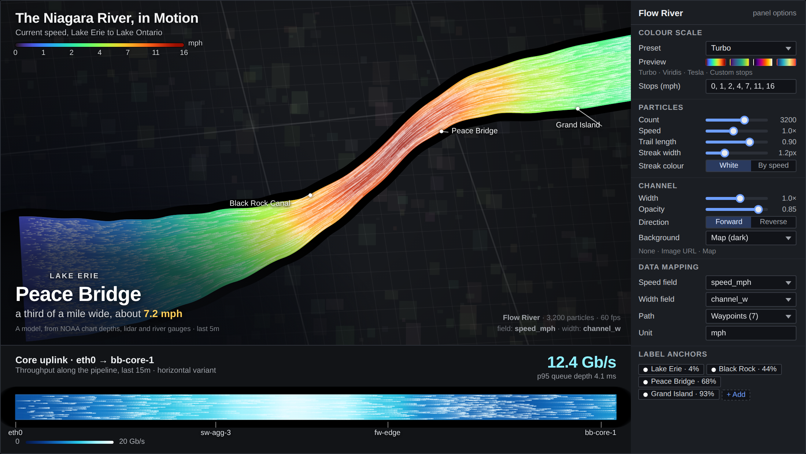

# Impact Flow River

A particle "river" that paints one or more channels on a canvas, coloured by value along their length and
animated with thousands of streak particles advected by the local speed. The channel's width can also follow
data, so a stream can narrow where it speeds up. Think of it as a sparkline you can feel moving: the panel's time
range *is* the river, flowing from the oldest sample at the start of the path to the newest at the end.

## Data

The panel reads **numeric fields** from the query result. Time fields are ignored (values are used in order).

### One series (default)

With no channels configured the panel draws a single S-curve bound to the **first numeric field** of the first
frame. A TestData "Random Walk" query works out of the box: the oldest value sits at the start of the river, the
newest at the end, and the caption shows the latest value.

### Several channels

Add channels in **Channels** (each has its own path, data source, width, colour scale, particles and labels).
A channel's **Speed** source decides where its values come from:

| Mode   | Behaviour                                                                                     |
| ------ | --------------------------------------------------------------------------------------------- |
| Series | A query `refId` (`A`, `B`), a frame name, or a 0-based frame index. Uses the frame's first numeric field. |
| Field  | A field by display name, searched across all frames (handy for wide frames or renamed fields). |
| Fixed  | A constant, useful for a decorative channel or a baseline.                                    |

**Auto-binding:** if a channel's series/field selector is left empty, channel *i* binds to numeric field *i*
(fields are counted across frames in order). So three random-walk queries A/B/C and three channels with no
explicit sources map 1:1 without any configuration.

### Parallel lanes (several series in one river)

With a **single channel** and more than one series, set **Multi-series** to *Parallel lanes*. Every numeric field
becomes a sub-lane of the channel, drawn side by side inside the channel width and coloured by its own value. The
legend uses the first field for unit and formatting. *Ignore* (the default) uses only the first field.

### Width from data

**Width from** works like the speed source. The width field is normalised to its maximum, so **Width (px)** is the
width at the widest point and the channel shrinks proportionally elsewhere. With *Fixed* the width is constant.

### Direction by sign

**Direction** can be *Forward*, *Reverse* or *By sign*. With *By sign* a channel whose mean value is negative flows
backwards (particles travel from the end of the path to the start). Colours still use the signed values, so a
diverging custom scale can show the sign while the motion shows the direction.

### Colour scales and the legend

Each channel picks a preset (`Turbo`, `Viridis`, `Inferno`, `Cool`, `Warm`), **Thresholds** (the standard field
thresholds, stepped) or **Custom stops** (value/colour pairs with piecewise-linear interpolation, so legend ticks sit
on the stops like a hand-made map legend). The scale domain is *Auto* (field min/max if set, otherwise the data
range) or *Fixed*. Legend ticks are formatted by the field display processor (unit, decimals from
**Standard options**).

## Options

| Option                       | Description                                                                               |
| ---------------------------- | ----------------------------------------------------------------------------------------- |
| Channels                     | List editor: add, remove, reorder channels. Each card has path, data, width, colour, particles and labels. |
| Channel > Path               | Waypoints as normalised `x, y` pairs (0..1). Presets: Horizontal, S-curve, Diagonal, U. **Edit on canvas** shows draggable handles on the panel. |
| Channel > Speed              | Series / Field / Fixed source for the values along the path.                              |
| Channel > Multi-series       | Ignore extra series, or draw each series as a parallel lane.                              |
| Channel > Direction          | Forward, Reverse, By sign.                                                                |
| Channel > Width (px)         | Base (maximum) width in CSS pixels.                                                       |
| Channel > Width from         | Optional data source that modulates the width along the path.                             |
| Channel > Smoothing          | Gaussian window (in samples) applied to speed and width before drawing. 0 = auto (5% of the samples, min 3). |
| Channel > Opacity            | Channel fill opacity.                                                                     |
| Channel > Scale              | Colour preset, thresholds or custom stops; domain auto or fixed.                          |
| Channel > Particles          | Count, speed, trail persistence, streak width and colour (White, By value, Fixed).        |
| Channel > Labels             | Text anchored at a position along the path (0..1), left / centre / right of the channel. Supports variables. |
| Default colour scale         | Used by the automatic channel when the list is empty.                                     |
| Show legend / Legend position| Gradient legend with formatted ticks and unit; corner placement.                          |
| Particle count multiplier    | Global multiplier (total particles capped at 20000 across all channels and lanes).        |
| Particle speed multiplier    | Global speed multiplier.                                                                  |
| Title / Subtitle / Caption   | Free text overlays. Variables are interpolated and `{value}` is replaced by the latest value of the first channel. |
| Big caption                  | Render the caption in a large display style.                                              |
| Show latest value            | Show "Channel: value" under the caption.                                                  |
| Background                   | Panel (dark fill), Image URL (`http(s)` or `data:image` only; cover/contain; dim slider), None (transparent). |
| Animate / Animation speed    | Toggle the particle loop and scale its speed. The loop pauses while the tab is hidden and stops on unmount. |

Standard field options (unit, decimals, min, max, thresholds, display name, overrides) apply to the bound fields.

## Tips

- Reduced motion: when the OS asks for reduced motion the panel renders the channel with static streaks instead of
  animating.
- For a pipeline look use a horizontal preset, a narrow width (40-60 px), the `Cool` scale and the *By value*
  streak colour.
- Raise **Smoothing** for very noisy series (it only affects the drawing, not the caption value); lower it to see every sample.
- Keep each channel at a few thousand particles. Very wide panels look best with a higher count and a longer trail
  (0.9).
- The panel reads values in frame order. If your source returns newest-first, add a *Sort by* transformation on the
  time field.
- Use the "Edit on canvas" switch on a channel to drag its waypoints, then switch it off before saving so the
  handles disappear.
